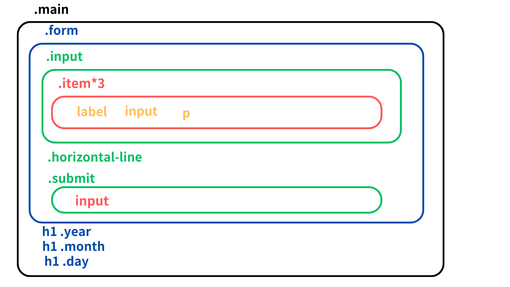
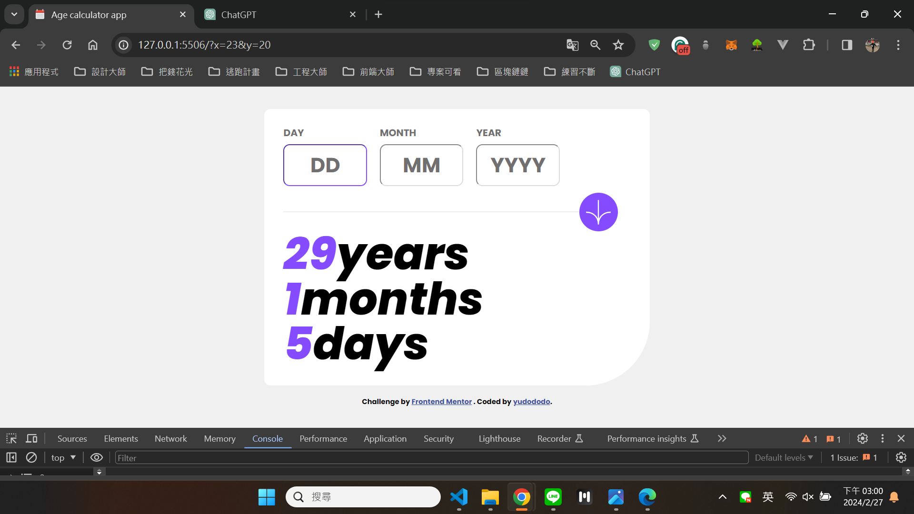
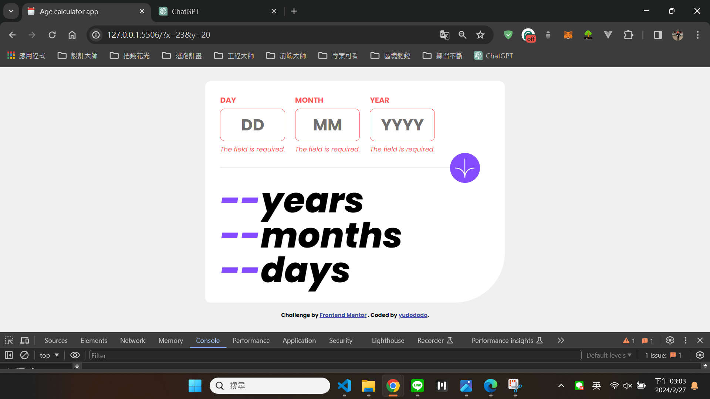
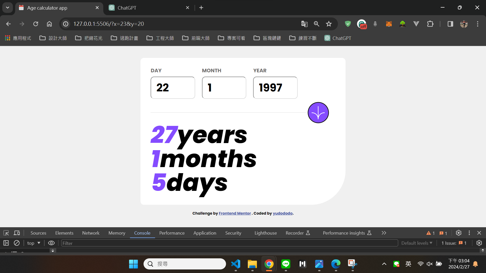
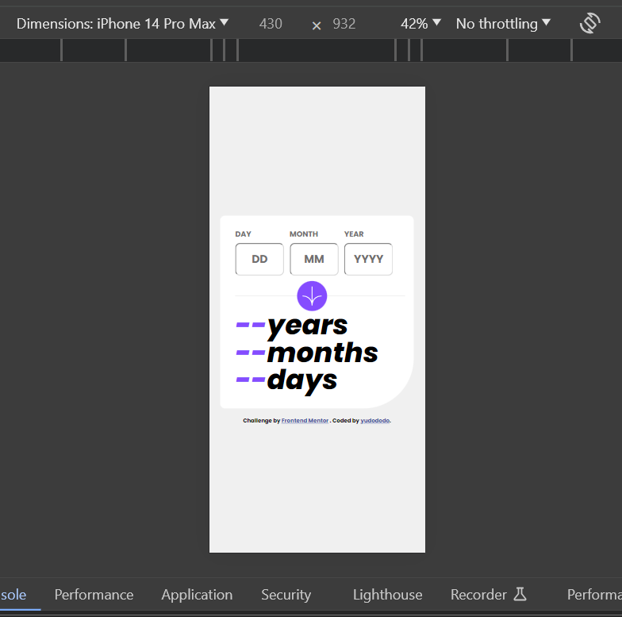

## Overview👀

Hello visitors, I created this github repo to help me practice and showcase my not so refined html, css and JS skill.
Hope that you get a grasp of my current front end skills and help me improve what I lack by sending feedbacks.🙏🙏🙏 

## Layout🌼

  

## Screenshot🐻💥

  
  
  

 
 

  

 

## The challenge🔥

Users should be able to:

- View an age in years, months, and days after submitting a valid date through the form
- Receive validation errors if:
  - Any field is empty when the form is submitted
  - The day number is not between 1-31
  - The month number is not between 1-12
  - The date is in the future
  - The date is invalid e.g. 31/04/1991 (there are 30 days in April)
- View the optimal layout for the interface depending on their device's screen size
- See hover and focus states for all interactive elements on the page

## What I learned💪

Learn JavaScript Date objects

## Author🐶

- Frontend Mentor - [@yudododo](https://www.frontendmentor.io/profile/yudododo)
- Instagram - [@yu_dododo](https://www.instagram.com/yu_dododo/)
